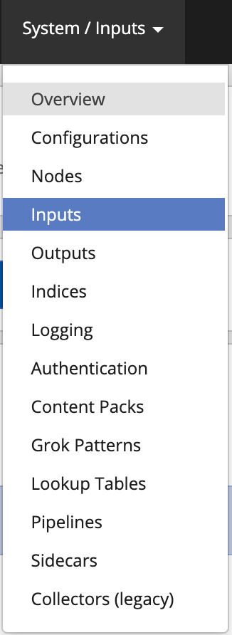
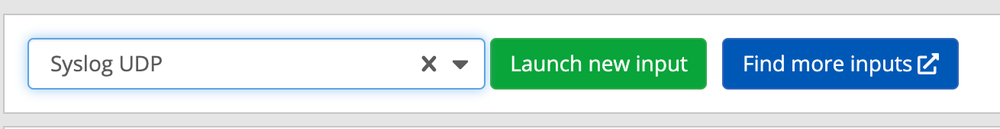
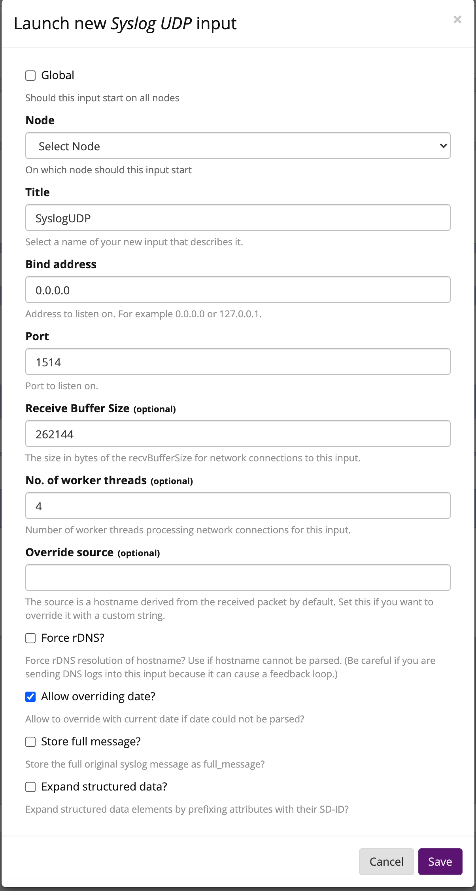

# How to Send Sensu Go events to Graylog

## Configure Graylog

Create a Syslog UDP input:








## Configure Sensu

Create a UDP handler to send all events to Graylog:

```
type: Handler
api_version: core/v2
metadata:
  created_by: admin
  labels:
    sensu.io/managed_by: sensuctl
  name: graylog_udp
  namespace: default
spec:
  env_vars: null
  filters: null
  handlers: null
  runtime_assets: null
  secrets: null
  socket:
    host: logs.example.com
    port: 1514
  timeout: 0
  type: udp
```

## 
